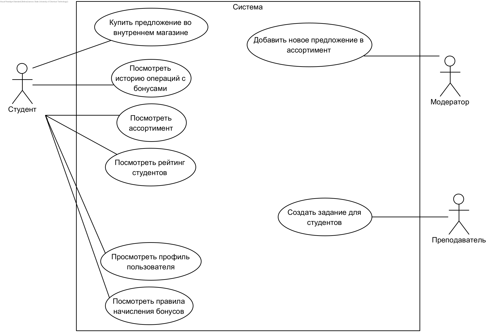
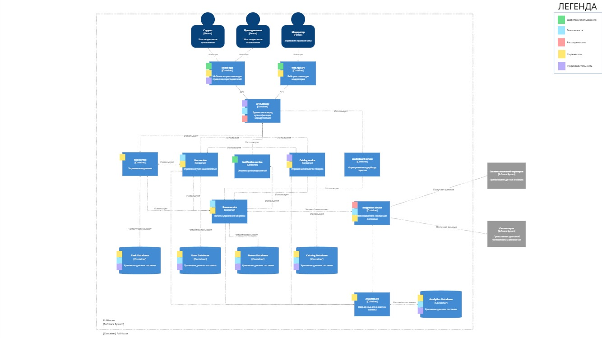
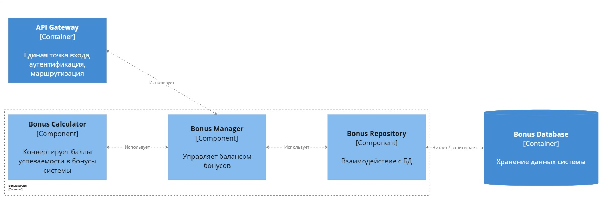
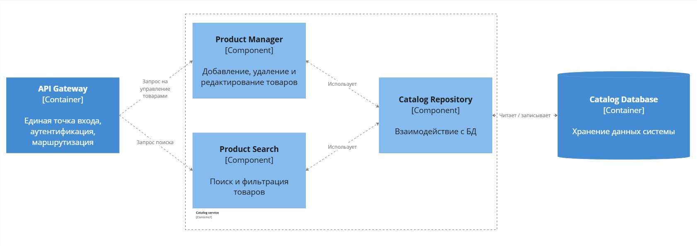
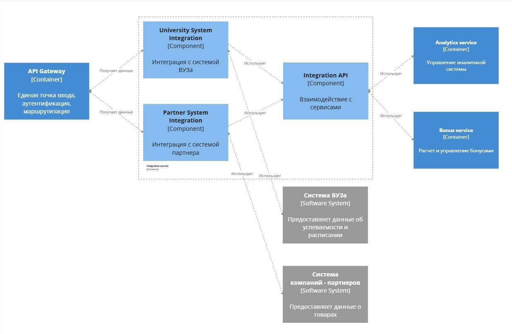
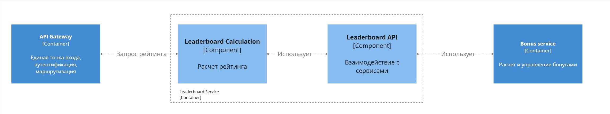
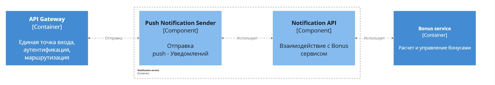
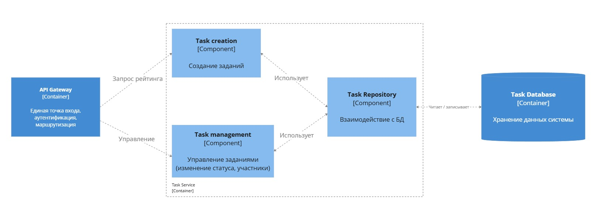
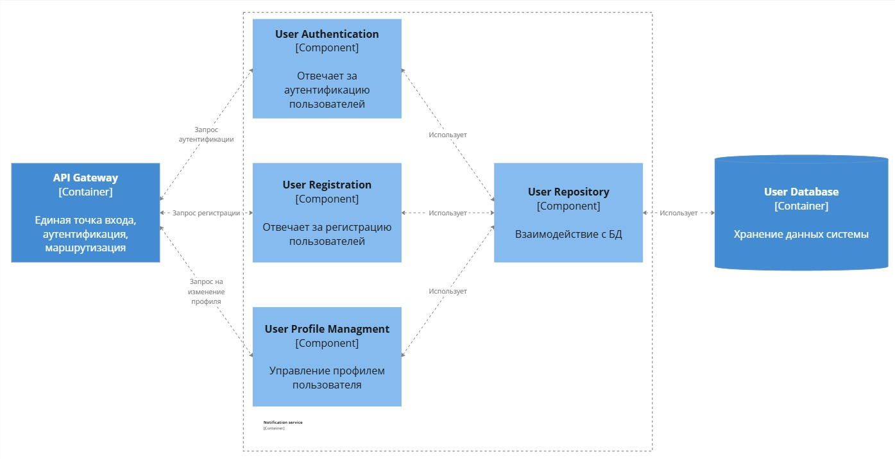

# FullHouse
Наш проект - система ориентированная на работу с вузами. она представляет собой приложение, которое награждает студентов за успехи в учебе и выполнение задания преподавателей, а также предоставляет информацию о мероприятиях в вузе. Каждую контрольную точку студенты будут получать заслуженное количество бонусов за успеваемость и выполненные задания.
Студенты в свою очередь смогут распоряжаться полученными бонусами в рамках внутреннего магазина, который будет аккумулировать в себе ряд предложений от компаний-партнеров. Предложениями являются купоны, акции, промокоды и т.п.
Наше решение поможет разнообразить учебный процесс и замотивировать студентов лучше учиться, а также позволит компаниям-партнерам продвигать свою продукцию и услуги и собирать статистику по товарам.

### Участники
- Аксенов Иван - главный программист
- Костина Полина - главный дизайнер
- Кочетков Кирилл - программист
- Бусыгин Андрей - тимлид
- Горюнов Александр - программист
- Соколова Арина - дизайнер
- Аминов Никита - программист

### Бизнес-цели
- Привлечь новых партнеров для учебного заведения
- Привлечь абитуриентов в учебное заведение

### Бизнес-процессы
Ссылка на проект в Miro - https://miro.com/app/board/uXjVIXSiXaQ=/?share_link_id=850159920305

**Начисление бонусов за успеваемость.** 
1. Каждый раз при наступлении КТ с сайта вуза получается успеваемость студентов
2. Когда получены данные об успеваемости баллы рейтинга конвертируются в бонусы системы.
    
    $\text{Процент успеваемости} = \frac{\text{Баллы за КТ}\ -\ \text{Баллы за предыдущую КТ}}{\text{Максимальные баллы за КТ}\ -\ \text{Максимальные баллы за предыдущую КТ}}$

    Если $\text{Процент успеваемости} > 90$: $k_{усп} = 1.5$

    Если $\text{Процент успеваемости} > 80$: $k_{усп} = 1.35$

    Если $\text{Процент успеваемости} > 65$: $k_{усп} = 1.2$

    Если $\text{Процент успеваемости} \ge 50$: $k_{усп} = 1.1$
    
    Если $\text{Процент успеваемости} < 50$: $k_{усп} = 1$

    $\text{Начисляемые бонусы} = (\text{Баллы за КТ}\ -\ \text{Баллы за предыдущую КТ}) * k_{усп}$
3. Когда баллы конвертированы в бонусы системы, они начисляются на счет аккаунта студента
4. Каждый раз после начисления бонусов система отправляет push-уведомление на устройство студента

**Покупка товара студентом**
1. В окне приложения студент открывает каталог товаров
2. Во вкладке каталога товаров студент выбирает товар
3. В зависимости от кол-ва баллов на балансе студента:
    1. Если у студента недостаточно бонусов на балансе, то ему отображается уведомление о недостатке бонусов
    2. Если у студента достаточно бонусов, то студенту предлагается купить товар
4. В карточке товара студент покупает товар, после чего стоимость товара списывается с баланса студента
5. Каждый раз после покупки товара он добавляется на аккаунт студента

**Добавление товара в ассортимент**
1. Компания-партнер предоставляет товар
2. В окне добавления товара модератор добавляет товар в каталог товаров
3. Если срок действия товара окончен, то товар скрывается

**Удаление товара из ассортимента**
1. Компания-партнер отзывает товар
2. В списке товаров модератор удаляет товар из каталога товаров

**Создание задания преподавателем**
1. В окне создания задания преподаватель создает задание
2. Каждый раз при создании задания оно добавляется в список заданий и с баланса аккаунта преподавателя списывается кол-во бонусов, указанное при создании задания
3. В зависимости от набравшегося кол-ва участников:
    1. Если не набралось указанное кол-во участников задание удаляется из списков и списанные у преподавателя бонусы возвращаются к нему на баланс
    2. Если набралось указанное кол-во участников, то задание скрывается для всех, кроме участников
4. В карточке задания преподаватель отмечает присутствовавших
5. Когда присутствовавшие отмечены на балансы этих студентов начисляются бонусы, указанные при создании задания и оно удаляется из списков

### Заинтересованные лица
| Заинтересованное лицо | Потребности, интересы | Задачи |
| --- | --- | --- |
| Студент | Заинтересован в получении бонусов за хорошую успеваемость, и последующей их трате на представленный в приложении ассортимент | Поддерживать хорошую успеваемость в вузе |
| Преподаватель | Мотивировать студентов к более активному участию в учебном процессе и внеучебных активностях | Добавление задач для студентов через приложение |
| Компания-партнер | Реклама своей компании, продукции и предоставляемых услуг и получение статистики об их востребованности | Партнерское взаимодействие с вузом и предоставление предложений для внутреннего магазина приложения |
| Администрация вуза | Мотивация студентов к активному участию в учебном процессе, привлечение компаний-партнеров и как следствие повышение рейтинга вуза | Предоставление доступа к данным системы рейтинга студентов |

### Функции и свойства

1. Начисление бонусов за успеваемость
2. Использование бонусов на покупки во внутреннем магазине
3. Сбор статистики об обороте бонусов в системе
4. Составление таблицы лидеров среди студентов по успеваемости
5. Создание преподавателями заданий для студентов
6. Обновление ассортимента внутреннего магазина
7. Предоставление информации об успеваемости студента
8. Авторизация студента по студенческому билету и паролю
9. Предоставление информации о расписании занятий студента
10. Награда за высокие позиции в лидерборде

### Качественные характеристики
1. Удобство использования - удобство в использовании сервиса пользователем. Удобный, приятный, интиуитивно понятный интерфейс. Удобная система уведомлений.
2. Безопасность - обеспечение безопасности передаваемых данных. Защита от эксплойтов, кибер-атак.
3. Расширяемость - создание архитектуры, позволяющей добавлять новый функционал приложения без значительных затрат по времени и ресурсам.
4. Надежность - обеспечение стабильной работы приложения и сервисов, даже при значительной нагрузке.
5. Производительность - обеспечение быстрой и плавной работы приложения и сервисов. Оптимизация работы системы. Обеспечение производительной работы приложения на разных устройствах.

### Внешние системы
1. Система вуза
2. Системы ассортимента компаний-партнеров

### Диаграмма вариантов использования

### Модель C4
#### Контекст системы

#### Контейнеры

#### Компоненты
**Bonus Service**

**Catalog Service**

**Integration Service**

**Leaderboard Service**

**Notification Service**

**Task Service**

**User Service**

### Диаграммы последовательности
#### Начисление бонусов за успеваемость

#### Покупка товара во внутреннем магазине

#### Создание задания преподавателем

### Запросы API
Отправитель | Данные обмена | Ответ и код | Получатель
| --- | --- | --- | --- |
Mobile App/Web App | `POST /auth/login` с `userId`, `password` | `200` Успешный вход `401` Неверные данные | User Service
Mobile App/Web App | `GET /users/me` с токеном авторизации | `200` Данные пользователя `401` Неавторизован | User Service
Mobile App/Web App/Task Service/Bonus Service | `GET /users/{userId}` | `200` Пользователь найден `404` Не найден | User Service
Mobile App | `PUT /users/{userId}` с обновлённым `email` | `200` Обновлено `404` Не найден | User Service
Mobile App/Web App | `GET /users/students/{studentId}/bonuses` | `200` Текущий баланс | User Service
Mobile App/Web App | `GET /catalog` | `200` Список товаров | Catalog Service
Web App | `POST /catalog` с объектом `Product` | `201` Товар добавлен `400` Ошибка ввода | Catalog Service
Mobile App/Web App/User Service | `GET /catalog/{productId}` | `200` Товар найден `404` Не найден | Catalog Service
Web App | `PUT /catalog/{productId}` с обновлёнными данными | `200` Товар обновлён `404` Не найден | Catalog Service
Web App | `DELETE /catalog/{productId}` | `204` Удалён `404` Не найден `410` Уже удалён | Catalog Service
Mobile App | `POST /catalog/{productId}/purchase` с `student_id` | `200` Покупка успешна `400` Недостаточно бонусов | Catalog Service
Mobile App/Web App | `GET /tasks` | `200` Список заданий | Task Service
Mobile App | `POST /tasks` с объектом `Task` | `201` Задание создано | Task Service
Mobile App/Web App/User Service | `GET /tasks/{taskId}` | `200` Задание найдено `404` Не найден | Task Service
Mobile App | `POST /tasks/{taskId}/attendance` с `attended_students` | `200` Бонусы начислены и задание завершено | Task Service
Mobile App/Web App | `GET /leaderboard` | `200` Список студентов с очками | Leaderboard Service
